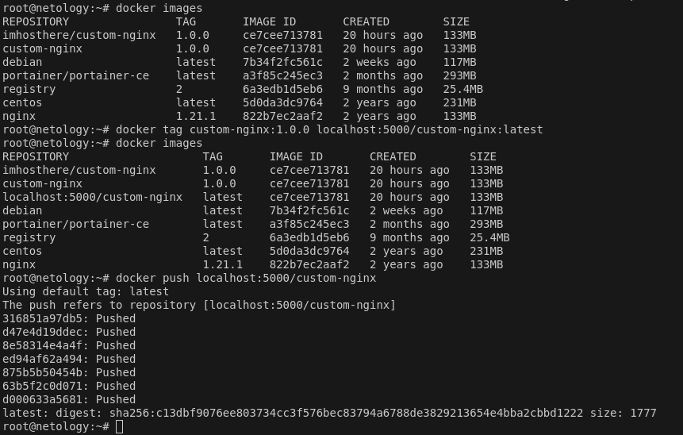
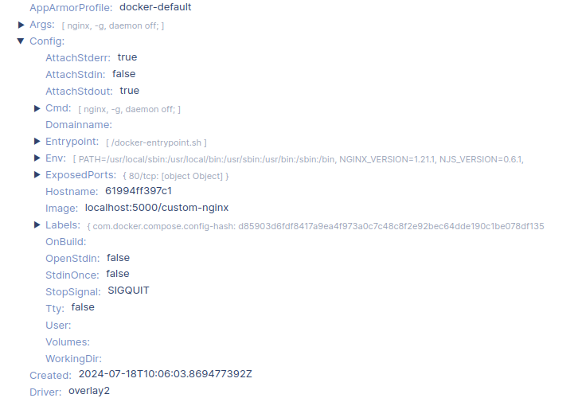
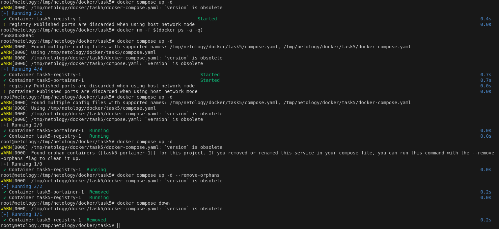

student: Zhivs
# Задание 1
https://hub.docker.com/repository/docker/imhosthere/custom-nginx/general

# Задание 2
1.

2.

3.

4.

# Задание 3
1.

2.

3.

Прописав команду docker attach, мы получили доступ к терминалу запущенного контейнера. Команда CTRL+C отправляет сигнал, останавливающий процесс терминала. Поскольку он является основным, его завершение приводит к остановке самого контейнера.

4.

5.

6.

7.

8.

9.

10.

В пункте 3.7 внутри контейнера был изменен конфигурационный файл nginx (заменили порт 80 на 81). А при запуске контейнера указывали внутренний порт 80й. Поэтому, когда с хоста обращаемся на порт 8080, запрос перенаправляется на 80й, но nginx его уже не слушает.

11.

12.

# Задание 4
1.

2.

3.

4.

5.

# Задание 5
1.

При выполнении команды `docker compose up -d` был выбран файл `compose.yaml`. Файл `compose`выбирается по умолчанию если существует. Название файла `docker-compose` существует для совместимости с более ранними версиями `compose`  

2. 

3. 

4. 

5. 

6. 

7.

После удаление манифеста `compose.yaml` и попытке запуска стека, было получено предупреждение об обнаружении запущенных контейнеров. Было предложено запустить стек с флагом `--remove-orphans`, чтобы уничтожить бесхозные контейнеры этого стека.