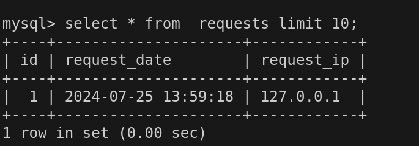
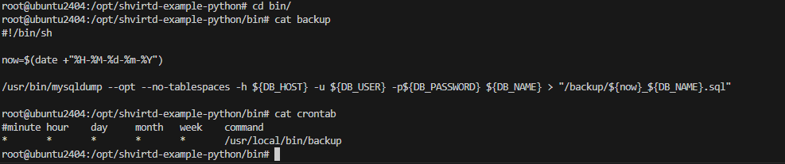

# Задание 0


# Задание 1

Комана для сборки образов из `compose.yaml`:
 
```
docker compose build
```

Dockerfile.python по заданию:
```Dockerfile
FROM python:3.9-slim

WORKDIR /app

COPY requirements.txt .

RUN pip install -r requirements.txt

COPY . .

CMD ["python", "main.py"]
```

Сборка:


Результат сборки:


Содержимое файла .dockerignore


# Задание 2
Отчет сканирования образа


# Задание 3


# Задание 4
Ссылка на репозиторий:
https://github.com/Helliard/shvirtd-example-python

Скрипт `deploy.sh`
```bash
#!/bin/bash

git clone https://github.com/Helliard/shvirtd-example-python.git /opt/shvirtd-example-python

cd /opt/shvirtd-example-python

docker compose up -d
```

Содержимое базы `requests`


# Задание 5

1. 
Скрипт `backup.sh`

```bash
#!/bin/bash

docker run \
    --rm --entrypoint "" \
    -v /opt/backup:/backup \
    --network shvirtd-example-python_backend \
    --link="shvirtd-example-python-db-1" \
    mydumper:latest \
    mysqldump --opt -h shvirtd-example-python-db-1 -uroot -pYtReWq4321 "--result-file=/backup/dumps.sql" virtd
```

❗С базовым образом schnitzler/mysqldump не завелось 

Ошибка:


Нужный плагин докачал еще одним слоем:
```Dockerfile
FROM schnitzler/mysqldump
RUN apk add --no-cache mariadb-connector-c
```

Дамп базы после ручного запуска:


2.
Скрипт и cron task:



Cron в `compose`:


Резервные копии:


# Задание 6
1. Узнаем digest необходимого слоя с помощью dive


2. Извлекаем необходимый файл


# Задание 6.1


