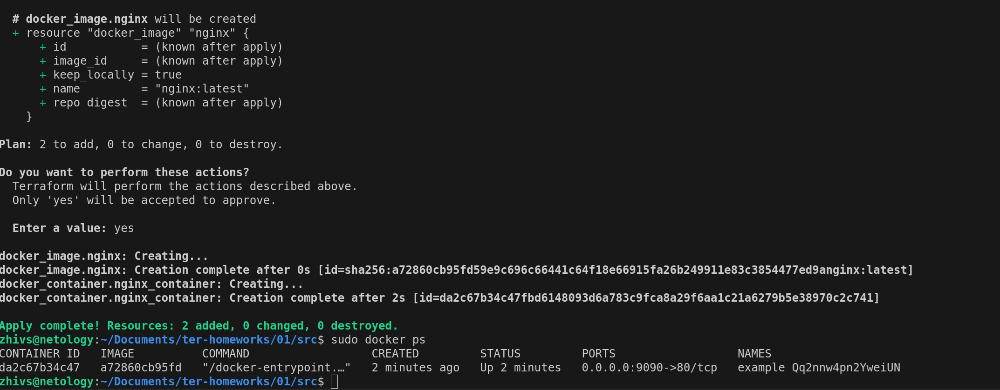

# Задание 0


# Задание 1

1. `.gitignore` в проекте:
```bash
# Local .terraform directories and files
**/.terraform/* #Игнорировать все директории и файлы проекта
.terraform* #Игнорировать в папку в корне

!.terraformrc #Исключение на файл, который должен попасть в репу

# .tfstate files
*.tfstate #все файлы с раширением tfstate 
*.tfstate.* #все файлы с паттерном чтоугодно.tfstate.чтоугодно

# own secret vars store.
personal.auto.tfvars # Место, куда мы можем положить наши персональные секреты


terraform.tfvars # Файл для управления переменными

tfplan #Автоматически созданный файл после комманды terraform plan
```

Согласно предоставленному `.gitignore`, секреты можно хранить в `personal.auto.tfvars`

2. Поиск случайной строки

Запуск: `terraform apply`


Искомая строка:


3. Команда `terraform validate` обновленного `main.tf` файла


Ошибки:

- Не задано имя `resource`. Блок ресурса должен состоять из двух составляющих: тип ресурса и его имя. На скриншоте выше видно, что не задано имя ресурса

Фикс:
```bash
resource "docker_image" "nginx" {
  name         = "nginx:latest"
  keep_locally = true
}
```
- Ошибка наименования ресурса. Имя ресурса должно начинаться строго с символа или нижнего подчеркивания. Может состоять из символов, чисел, нижних подчеркивания и слешей.
Фикс:
```bash
resource "docker_container" "nginx_container" {
  image = docker_image.nginx.image_id
  name  = "example_${random_password.random_string_FAKE.resulT}"

  ports {
    internal = 80
    external = 9090
  }
}
```
- Неправильное обращение по имени ресурса example_${random_password.random_string_FAKE.resulT}"

Фикс:
```bash
resource "docker_container" "nginx_container" {
  image = docker_image.nginx.image_id
  name  = "example_${random_password.random_string.result}"

  ports {
    internal = 80
    external = 9090
  }
}
```

Полный лог ошибок и успешное прохождение валидации в конце:


4. Полный исправленный код и команда `docker ps`
```bash
terraform {
  required_providers {
    docker = {
      source  = "kreuzwerker/docker"
      version = "~> 3.0.1"
    }
  }
  required_version = "~>1.8.4" /*Многострочный комментарий.
 Требуемая версия terraform */
}
provider "docker" {}

#однострочный комментарий

resource "random_password" "random_string" {
  length      = 16
  special     = false
  min_upper   = 1
  min_lower   = 1
  min_numeric = 1
}

resource "docker_image" "nginx" {
  name         = "nginx:latest"
  keep_locally = true
}

resource "docker_container" "nginx_container" {
  image = docker_image.nginx.image_id
  name  = "example_${random_password.random_string.result}"

  ports {
    internal = 80
    external = 9090
  }
}

```


5. Измененное имя контейнера:


Опасность использоваия ключа `-auto-approve` может быть обусловлена тем, что мы уничтожаем предыдущий стейт инфраструктуры, в котором может содержатся чувствительная информация, которую мы не хотим потерять.
Где может быть использовано: при автоматическом развертывании инфрастуктуры. Исключаем присутствие на этом шаге человека.

6. Уничтожение ресурсов


Содержимое файла `terraform.tfstate` после удаления ресурсов

```bash
{
  "version": 4,
  "terraform_version": "1.8.4",
  "serial": 11,
  "lineage": "1056714b-c4b3-593d-663b-1ca9ad12010e",
  "outputs": {},
  "resources": [],
  "check_results": null
}
```

7. Докер-образ остался после уничтожения ресурсов благодаря флагу `keep_locally`
```bash
resource "docker_image" "nginx" {
  name         = "nginx:latest"
  keep_locally = true
}
```
Пруфы на https://docs.comcloud.xyz/providers/kreuzwerker/docker/latest/docs/resources/image

`keep_locally` (Boolean) If true, then the Docker image won't be deleted on destroy operation. If this is false, it will delete the image from the docker local storage on destroy operation.

# Задание 2
Создана ВМ из консоли
Итоговый баш скрипт по заданию:
```bash
terraform {
  required_providers {
    docker = {
      source  = "kreuzwerker/docker"
      version = "3.0.2"
    }
  }
}

provider "docker" {
  host     = "ssh://user@user:22"
  ssh_opts = ["-o", "StrictHostKeyChecking=no", "-o", "UserKnownHostsFile=/dev/null"]
}


#однострочный комментарий

resource "random_password" "mysql_root_password" {
  length      = 16
  special     = false
  min_upper   = 1
  min_lower   = 1
  min_numeric = 1
}

resource "docker_image" "mysql" {
  name         = "mysql:8"
  keep_locally = true
}

resource "docker_container" "mysql_container" {
  name  = "MysqlFromTerraform"
  image = docker_image.mysql.image_id
  env = [
    "MYSQL_ROOT_PASSWORD=${random_password.mysql_root_password.result}",
    "MYSQL_DATABASE=wordpress",
    "MYSQL_USER=wordpress",
    "MYSQL_PASSWORD=${random_password.mysql_root_password.result}",
    "MYSQL_ROOT_HOST=%"
  ]

  ports {
    internal=3306
    external=3306
    ip="127.0.0.1"
  }
}
```

Получившийся контейнер на ВМ:


Сгенеренные креды:


Успешный коннект по кредам:


# Задание 3

Получившийся через `tofu` контейнер на ВМ:


Новые креды:
