# Основы Terraform. Yandex Cloud

# Задание 1
Иcправления в файле `main.tf`

1. platform_id = "standart-v4"  -> "standard-v1". Необязательный параметр, определяет тип виртуальной машины
2. cores = 1 -> 2, недопустимое число ядер

Web-интерфейс консоли Yandex Cloud


Команда `curl ifconfig.me` в автоматически созданной VM ubuntu

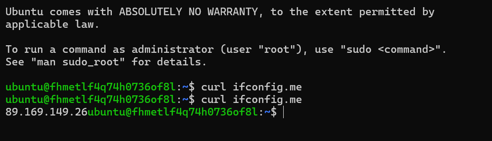


Ответы на вопросы:

1. Параметр `preemptible` (по умолчанию значение `false`) необходим для создания прерываемой виртуальной машины. В процессе обучения нам это необходимо для экономии денежных ресурсов.
2. Параметр `core_fraction` необходим, чтобы задать базовую производительность для ядра в процентах. Экономия денежных ресурсов.

# Задание 2 

Объявленнные переменные:
```GO
###VM vars

variable "vm_web_family" {
  type        = string
  default     = "ubuntu-2004-lts"
  description = "The name of the image family to which this image belongs."
}

variable "vm_web_name" {
  type        = string
  default     = "zhivs-develop-platform"
  description = "VM name"
}

variable "vm_web_platform_id" {
  type        = string
  default     = "standard-v1"
  description = "The type of virtual machine to create. The default is 'standard-v1"
}

variable "vm_web_resources" {
  type        = object({cores = number, memory = number, core_fraction = number})
  default     = {cores = 2, memory = 1, core_fraction = 5}
  description = "Compute resources that are allocated for the instance"  
}

variable "vm_web_is_preemptible" {
  type = bool
  default = true
  description = "Specifies if the instance is preemptible"
}

variable "vm_web_is_nat" {
  type = bool
  default = true
  description = "Specifies if the instance is nat"
}
```

Команда `terraform apply`. Нет изменений

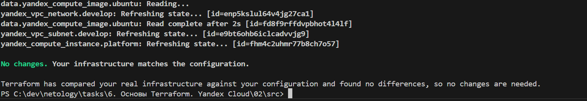

# Задание 3

Чтобы обеспечить разные зоны у VM, добавил подсети `develop-a` и `develop-b`. 

```GO
resource "yandex_vpc_subnet" "develop-a" {
  name           = var.vpc_subnet_name_a
  zone           = var.default_zone
  network_id     = yandex_vpc_network.develop.id
  v4_cidr_blocks = var.default_cidr
}

resource "yandex_vpc_subnet" "develop-b" {
  name           = var.vpc_subnet_name_b
  zone           = var.vm_db_zone
  network_id     = yandex_vpc_network.develop.id
  v4_cidr_blocks = var.vm_db_cidr
}
```
Скриншот web-консоли. Созданы 2 vm по заданию
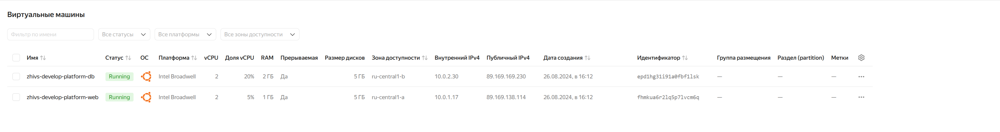

# Задание 4
Содержимое файла `ouput.tf`


```GO
output "vm_external_addresses" {
  value       = { 
    "${var.vm_web_name}" = format("IP:%s, FQDN:%s", resource.yandex_compute_instance.platform_web.network_interface.0.nat_ip_address, resource.yandex_compute_instance.platform_web.fqdn), 
    "${var.vm_db_name}" = format("IP:%s, FQDN:%s", resource.yandex_compute_instance.platform_db.network_interface.0.nat_ip_address, resource.yandex_compute_instance.platform_db.fqdn), 
}
  description = "Extermal IPs of VMs."
}
```

Вывод `terraform output`

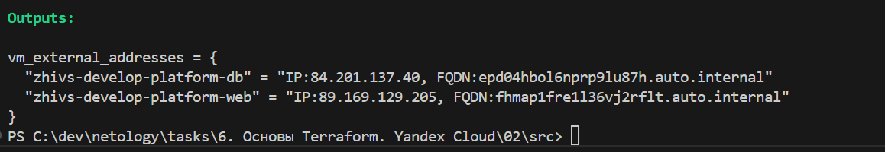

# Задание 5

Содержимое файла `locals.tf`

```GO
locals {
    platform_web_name = "${var.vm_web_name}-zone-${var.default_zone}"
    platform_db_name = "${var.vm_db_name}-zone-${var.vm_db_zone}"
}
```

Имя ВМ после применения изменений:

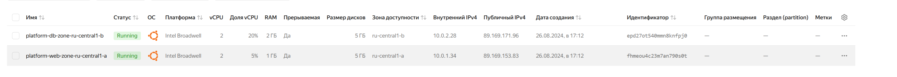

# Задание 6
1. Обновленные ресурсы vm:
```GO
variable "vms_resources" {
    type = map(object({
        cores         = number
        memory        = number
        core_fraction = number
    }))
    default = {
        web = {
            cores = 2,
            memory = 1,
            core_fraction = 5
        },
        db = {
            cores = 2, 
            memory = 2, 
            core_fraction = 20
        }
    }
}
```
2. Переменная `metadata`:

```GO
variable "metadata" {
    type    = map(string)
    default = {
        serial-port-enable = 1,
        ssh-keys = "ubuntu:ssh-ed25519 sec"
    }
}
```

Инфраструктура без изменений:

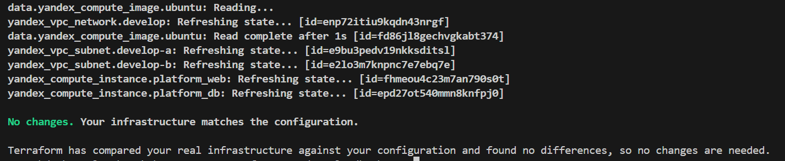

Неиспользуемые переменные: `vms_ssh_root_key`, `vm_web_resources`, `vm_db_resources`

# Задание 7 

1.
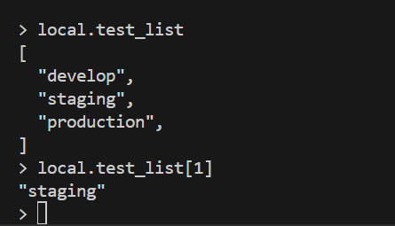

2.


3.
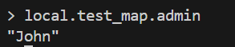

4.
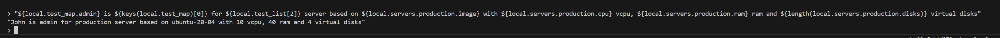

# Задание 8

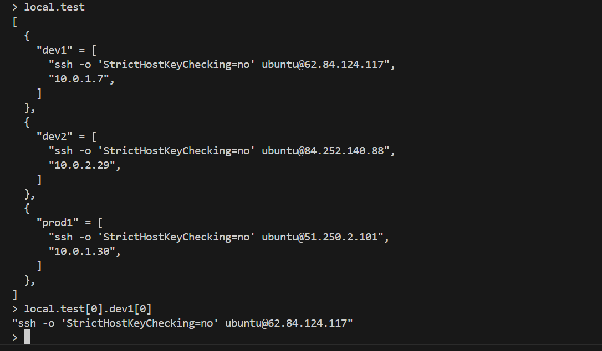

# Задание 9
Для настройки NAT-шлюза добавил ресурсы `yandex_vpc_gateway` и `yandex_vpc_route_table` и переменные `nat_gateway_name` и `route_table_name` в `variables.tf`
Изменения в main.tf:
```GO
resource "yandex_vpc_gateway" "nat_gateway" {
  folder_id      = var.folder_id
  name           = var.nat_gateway_name
  shared_egress_gateway {}
}

resource "yandex_vpc_route_table" "rt" {
  folder_id  = var.folder_id
  name       = var.route_table_name
  network_id = yandex_vpc_network.develop.id

  static_route {
    destination_prefix = "0.0.0.0/0"
    gateway_id         = yandex_vpc_gateway.nat_gateway.id
  }
}
```
Демонстрация, что нет внешнего IP, но сеть Интернет присутствует:

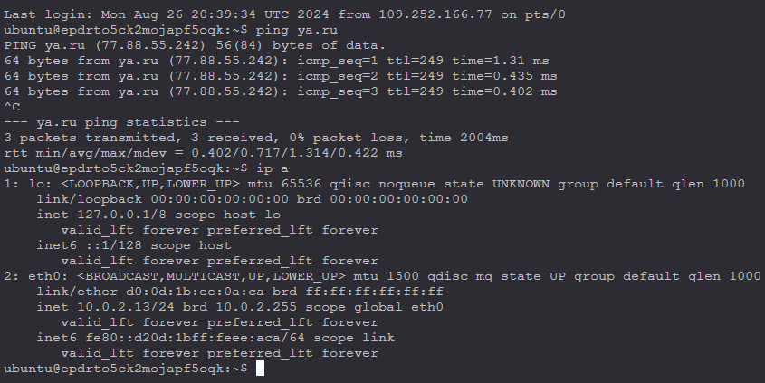