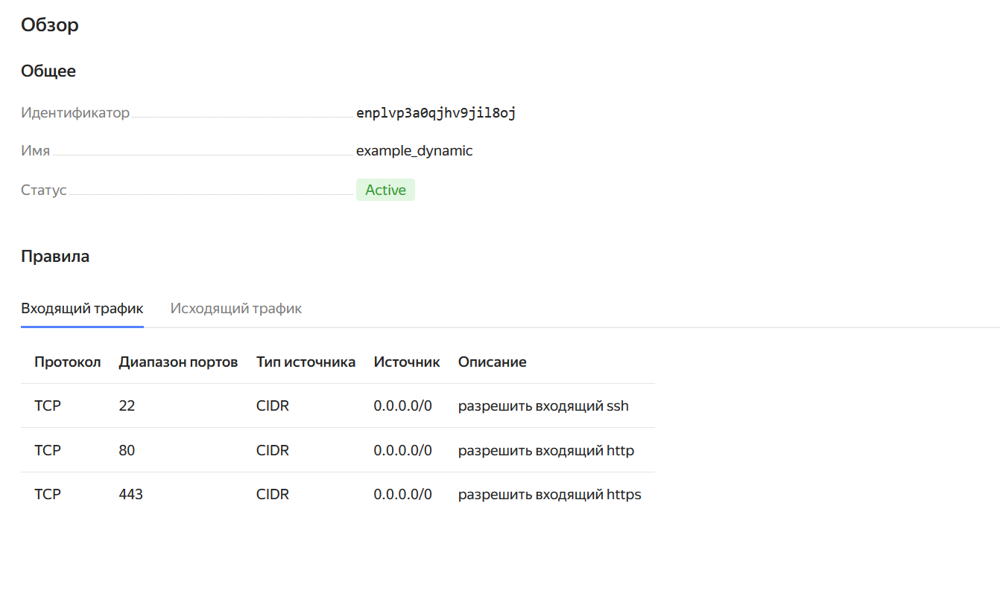
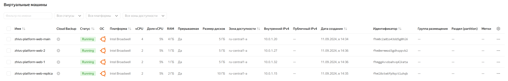
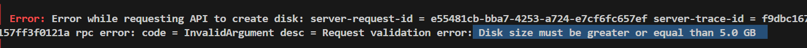
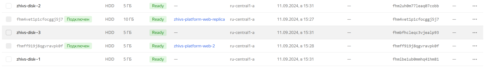
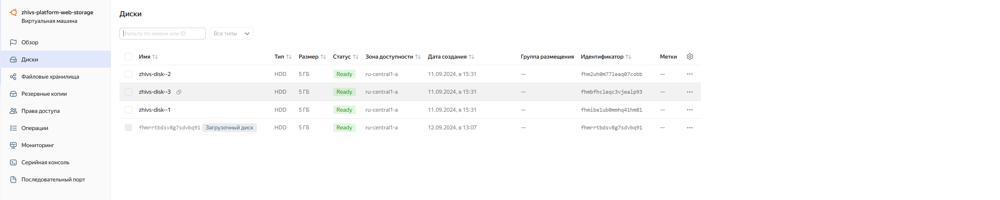
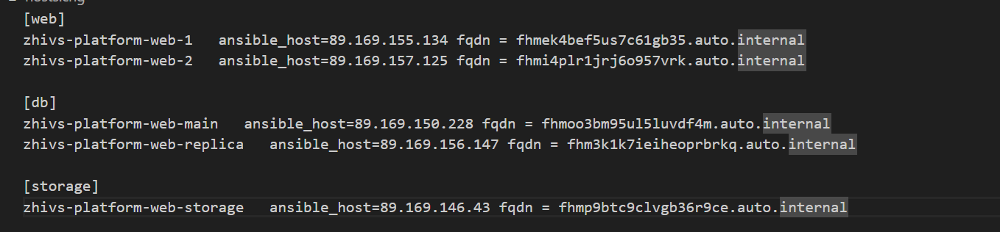
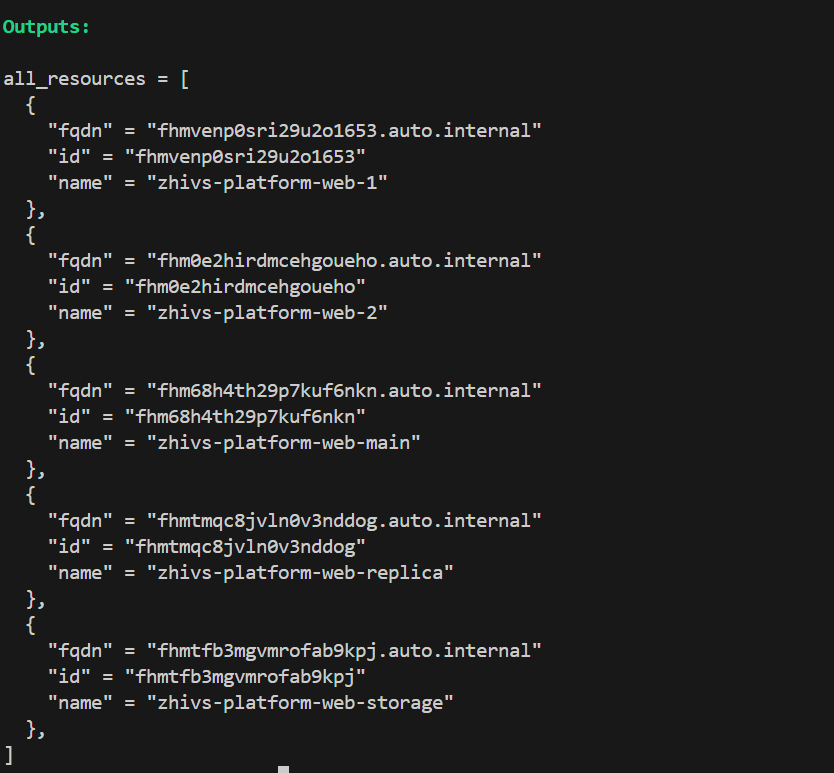

# Управляющие конструкции в коде Terraform

# Задание 1
Группы безопасности:

# Задание 2 
[Создание виртуалок с помощью `count`](./task2/count-vm.tf)

[Создание виртуалок с помощью `for_each`](./task2/for_each-vm.tf)

Скриншот консоли:

2 одинаковые виртуалки `zhivs-platform-web-1(2)` и разные `zhivs-platform-web-replica(main)`

# Задание 3

Минимальный размер диска 5 Гб, по заданию 1.

Созданные диски:

[Создание виртуальной машины с дисками](./task3/disk_vm.tf)

Созданная ВМ:

# Задание 4
[Файл инвентаря для `ansible` ](./task4/ansible.tf)

[Файл-шаблон для `ansible` ](./task4/hosts.tftpl)

Результирующий файл после запуска ВМ:

# Задание 5

[Файл `out.tf` ](./task5/out.tf)

Вывод всех созданных ресурсов:
