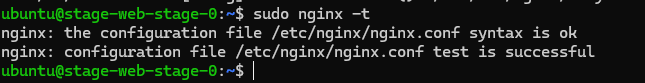
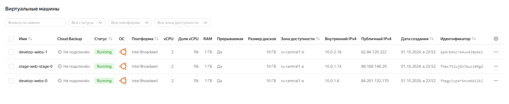
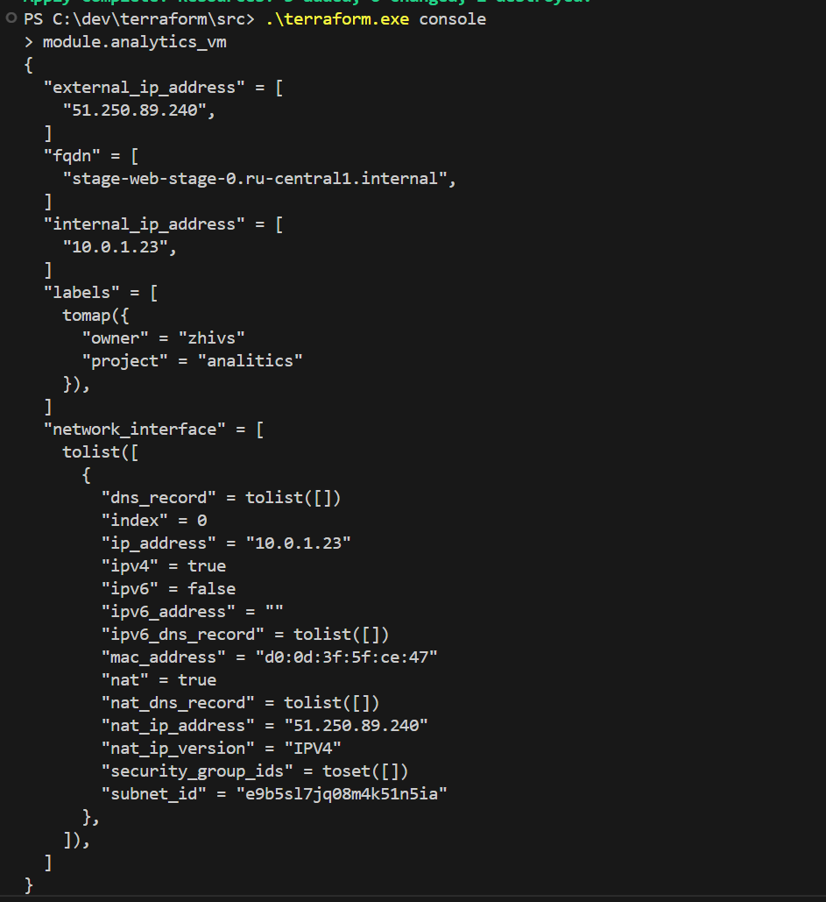
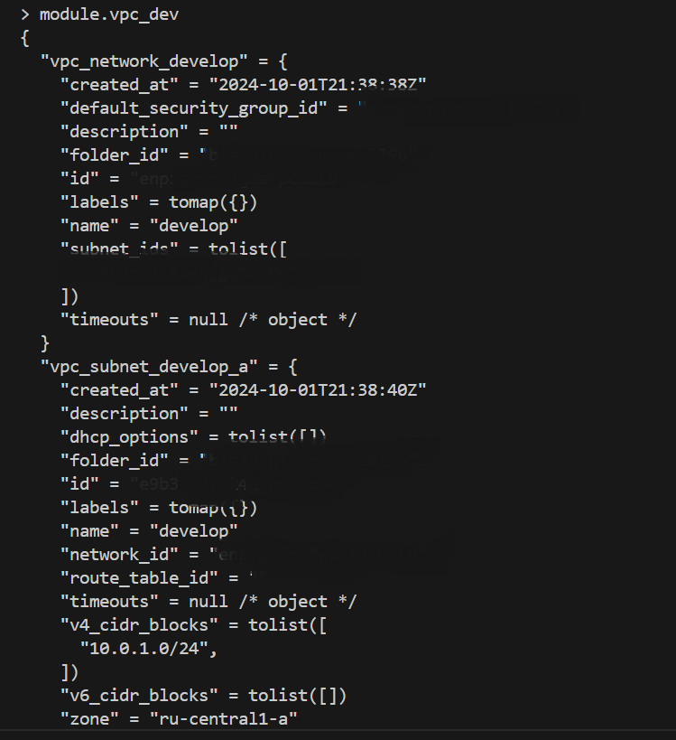
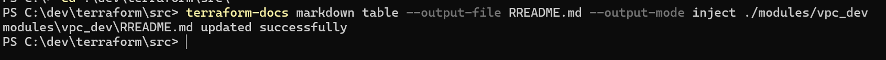
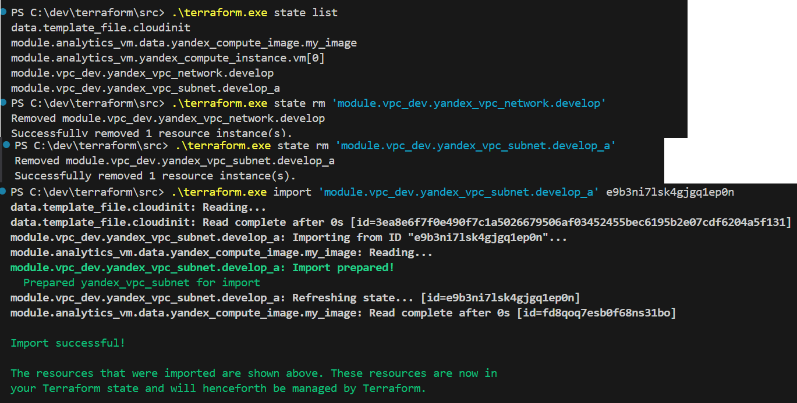

# Продвинутые методы работы с Terraform

## Задание 1

[Исправленный код](./task1/)

1. Cкриншот подключения к консоли и вывод команды `sudo nginx -t`

2. Cкриншот консоли ВМ yandex cloud с их метками:

3. Cкриншот содержимого модуля `analytics`

## Задание 2
[Код локального модуля](./task2/)

Вызов локАльного модуля в консоли:

Документирование локального модуля:

## Задание 3
