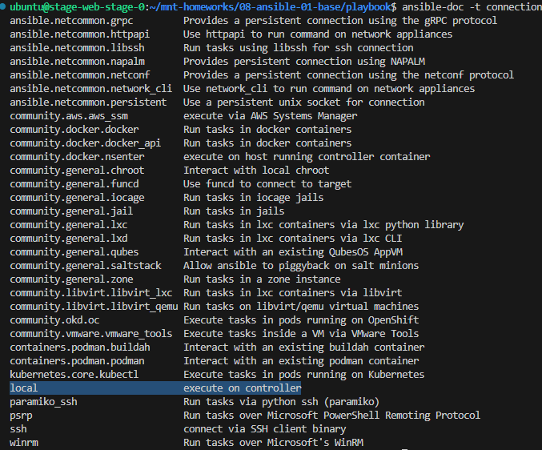
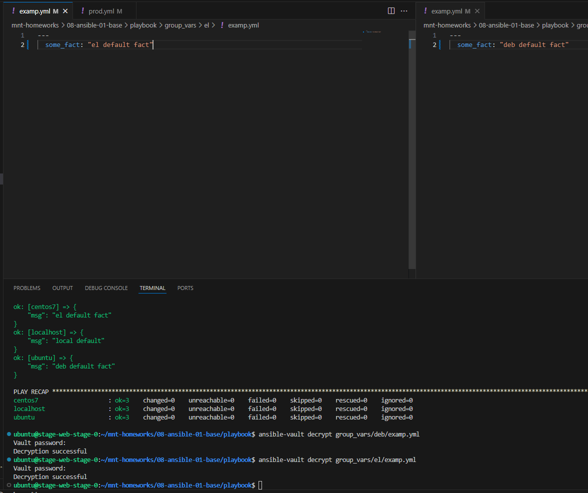

# Введение в Ansible

Основная часть:

1. Запуск playbook из окружения на окружении из `test.yml`

Команда: `ansible-playbook site.yml -i inventory/test.yml`


Значение факта для хоста: 12

2. Поменял в examp.yml Значение переменной `some_fact` с 12 на all default fact 


3. Подготовленное окружение:


4. Запуск playbook из окружения на окружении из `prod.yml`


5. Изменение значение переменной:


6. Повтор запуска playbook:


7. Шифрование переменных с помощью `ansible-vault`


8. Повтор запуска playbook:


9. `ansible-doc -t connection -l`
Подойдет Local



10. Обновленный prod.yml


11. Повтор запуска playbook:


# Задание со *

1. Decrypt зашифрованных playbook



2. Шифрование отдельного значения переменной: `ansible-vault encrypt_string 'PaSSw0rd'`. Добавил в переменную для ubuntu, поскольку домашняя машина ubuntu

Вывод фактов: 


3. Добавил новую группу хостов:


4. Автоматизация запуска docker-контейнеров:
```docker
version: "3"
services:
  ubuntu:
    container_name: ubuntu
    image: pycontribs/ubuntu:latest
    restart: on-failure
    command: ["sleep", "infinity"]
  centos:
    container_name: centos7
    image: pycontribs/centos:7
    restart: on-failure
    command: ["sleep", "infinity"]
  fedora:
    container_name: fedora
    image: pycontribs/fedora:latest
    restart: on-failure
    command: ["sleep", "infinity"]
```