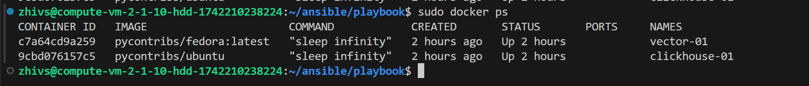
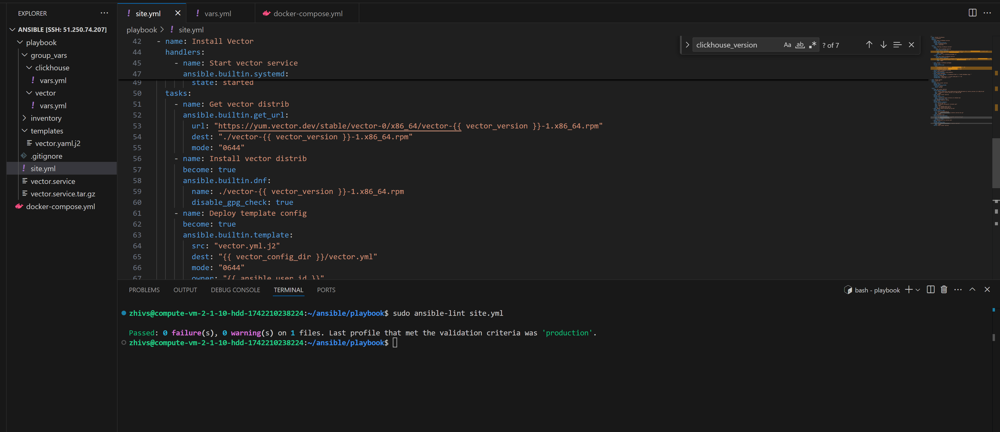
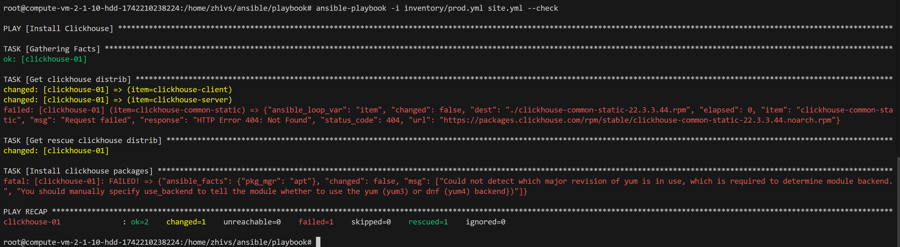
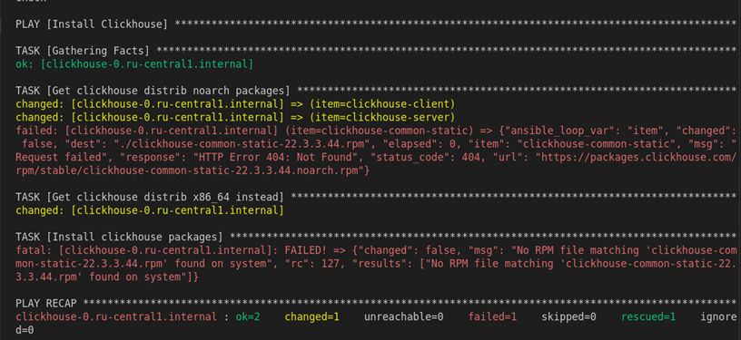
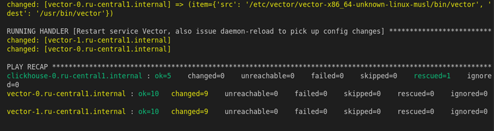

# Работа с Playbook

## Настройка окружения
1. Подготовка окружения:


2. Запуск окружения:
`docker-compose up -d`

3. Результат развертывания:


## Подготовка playbook

Исправленный `playbook.yml` для установки clickhouse:

```yml
---

- name: Install Clickhouse
  hosts: clickhouse
  tags: clickhouse
  handlers:
    - name: Start clickhouse service
      become: true
      ansible.builtin.service:
        name: clickhouse-server
        state: restarted
  tasks:
    - name: Download Clickhouse distrib
      block:
        - name: Get clickhouse distrib noarch packages
          ansible.builtin.get_url:
            url: "https://packages.clickhouse.com/rpm/stable/{{ item }}-{{ clickhouse_version }}.noarch.rpm"
            dest: "./{{ item }}-{{ clickhouse_version }}.rpm"
            mode: "0644"
          with_items: "{{ clickhouse_packages }}"
      rescue:
        - name: Get clickhouse distrib x86_64 instead
          ansible.builtin.get_url:
            url: "https://packages.clickhouse.com/rpm/stable/clickhouse-common-static-{{ clickhouse_version }}.x86_64.rpm"
            dest: "./clickhouse-common-static-{{ clickhouse_version }}.rpm"
            mode: "0644"
    - name: Install clickhouse packages
      become: true
      ansible.builtin.yum:
        name:
          - clickhouse-common-static-{{ clickhouse_version }}.rpm
          - clickhouse-client-{{ clickhouse_version }}.rpm
          - clickhouse-server-{{ clickhouse_version }}.rpm
      notify: Start clickhouse service
    - name: Set the default listen address
      become: true
      ansible.builtin.lineinfile:
        path: /etc/clickhouse-server/config.xml
        regex: '^.*<listen_host>::</listen_host>'
        line: '    <listen_host>::</listen_host>'
        backrefs: true
    - name: Flush handlers
      ansible.builtin.meta: flush_handlers
    - name: Create database
      ansible.builtin.command: "clickhouse-client -h 0.0.0.0 -q 'create database logs;'"
      register: create_db
      failed_when: create_db.rc != 0 and create_db.rc != 82
      changed_when: create_db.rc == 0

- name: Install Vector
  hosts: vector-01
  handlers:
    - name: Start vector service
      become: true
      ansible.builtin.systemd:
        service: vector
        state: started
  tasks:
    - name: Get vector distrib
      ansible.builtin.get_url:
        url: "https://yum.vector.dev/stable/vector-0/x86_64/vector-{{ vector_version }}-1.x86_64.rpm"
        dest: "./vector-{{ vector_version }}-1.x86_64.rpm"
        mode: "0644"
    - name: Install vector distrib
      become: true
      ansible.builtin.dnf:
        name: ./vector-{{ vector_version }}-1.x86_64.rpm
        disable_gpg_check: true
    - name: Deploy template config
      become: true
      ansible.builtin.template:
        src: "vector.yml.j2"
        dest: "{{ vector_config_dir }}/vector.yml"
        mode: "0644"
        owner: "{{ ansible_user_id }}"
        group: "{{ ansible_user_gid }}"
    - name: Deploy vector.service.tar.gz unit
      become: true
      ansible.builtin.copy:
        src: vector.service.tar.gz
        dest: "{{ vector_service_dir }}/vector.service.tar.gz"
        mode: "0644"
    - name: Unarchive unit
      ansible.builtin.unarchive:
        src: "{{ vector_service_dir }}/vector.service.tar.gz"
        dest: "{{ vector_service_dir }}"
        remote_src: true
    - name: Permissions for service unit
      become: true
      ansible.builtin.file:
        path: "{{ vector_service_dir }}/vector.service"
        mode: "0644"
      notify: Start vector service
```
## Проверка синтаксиса плейбука:



Запуск c ```check```




Запуск c ```diff```



Повторный запуск с ключем ```diff``` для проверки индепотентности. 

