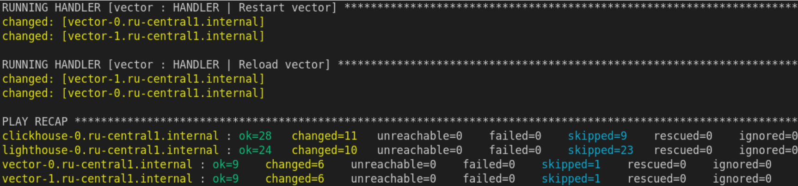
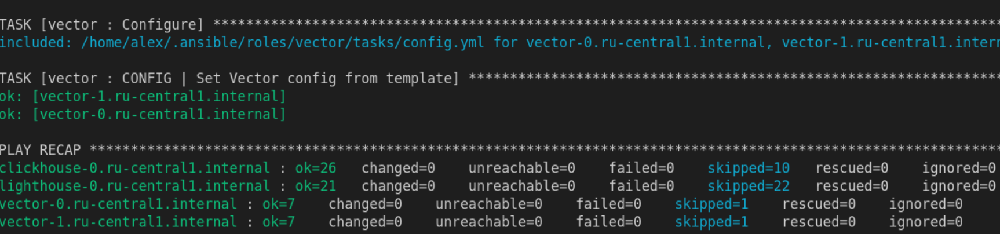
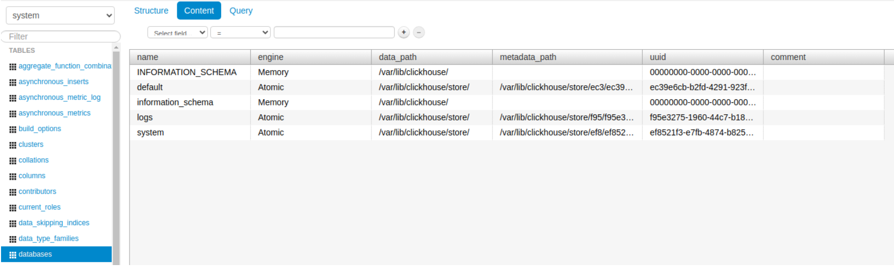

# Домашнее задание к занятию 4 «Работа с roles»


**Что нужно сделать**

1. Создайте в старой версии playbook файл `requirements.yml` и заполните его содержимым:

   ```yaml
   ---
     - src: git@github.com:AlexeySetevoi/ansible-clickhouse.git
       scm: git
       version: "1.13"
       name: clickhouse 
   ```

2. При помощи `ansible-galaxy` скачайте себе эту роль.
3. Создайте новый каталог с ролью при помощи `ansible-galaxy role init vector-role`.
4. На основе tasks из старого playbook заполните новую role. Разнесите переменные между `vars` и `default`. 
5. Перенести нужные шаблоны конфигов в `templates`.
6. Опишите в `README.md` обе роли и их параметры. Пример качественной документации ansible role [по ссылке](https://github.com/cloudalchemy/ansible-prometheus).
7. Повторите шаги 3–6 для LightHouse. Помните, что одна роль должна настраивать один продукт.
8. Выложите все roles в репозитории. Проставьте теги, используя семантическую нумерацию. Добавьте roles в `requirements.yml` в playbook.
9. Переработайте playbook на использование roles. Не забудьте про зависимости LightHouse и возможности совмещения `roles` с `tasks`.
10. Выложите playbook в репозиторий.
11. В ответе дайте ссылки на оба репозитория с roles и одну ссылку на репозиторий с playbook.

#### Решение

  
Clickhouse и Lighthouse будут ставиться на отдельные ВМ, Vector на две другие ВМ

[Роль для Vector](https://github.com/zhivs/ansible_role_vector)  
[Роль для Lighthouse](https://github.com/zhivs/ansible_role_lighthouse), зависимость роли с официальной ролью ```nginxinc.nginx```


Для play "Install Lighthouse" добавил pre_tasks с установкой git



Повторный запуск для проверки идемпотентности



Доступ к Lighthouse и коннект к Clickhouse:


