# Домашнее задание к занятию 11 «Teamcity»

ВМ в соответствии с заданием:

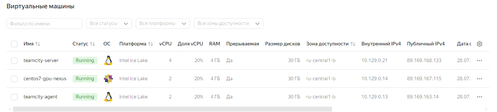

Авторизовал агент:

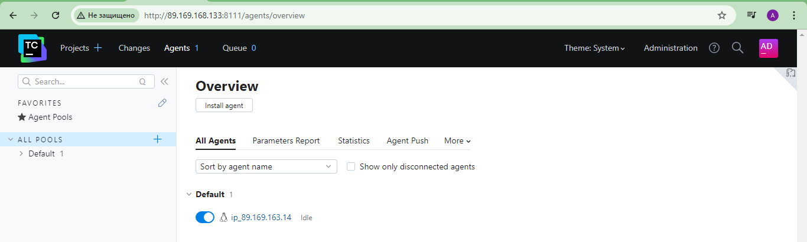

Запустил [playbook](./infrastructure).

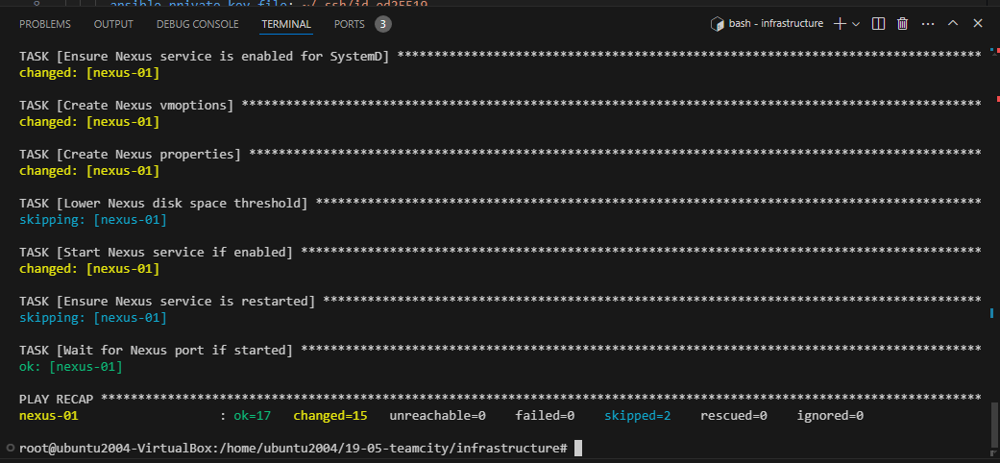

1. Создал новый проект в teamcity на основе fork.
2. Сделал autodetect конфигурации.
3. Сохранил необходимые шаги, запустил первую сборку master. Сборка прошла успешно:

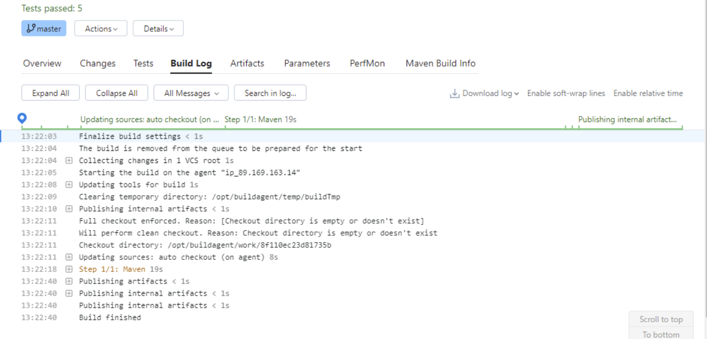

4. Поменял условия сборки: если сборка по ветке `master`, то должен происходит `mvn clean deploy`, иначе `mvn clean test`:

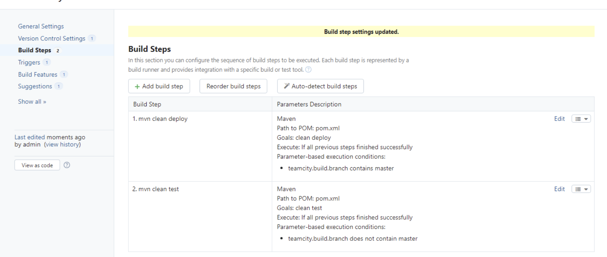

5. Для deploy загрузил [settings.xml](./teamcity/settings.xml) в набор конфигураций maven у teamcity, предварительно записав туда креды для подключения к nexus:

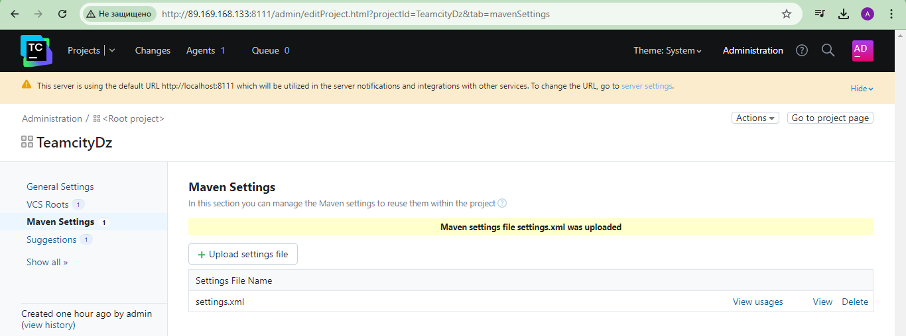

6. В pom.xml поменял ссылки на репозиторий и nexus:

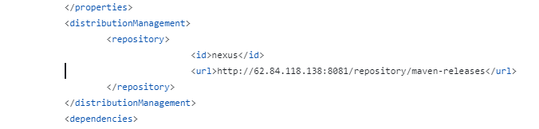

7. Запустил сборку по master, убедился, что всё прошло успешно и артефакт появился в nexus:

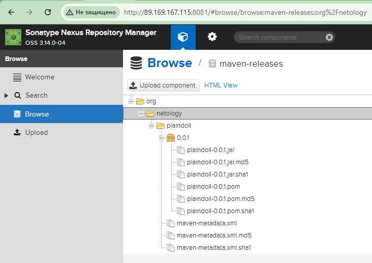

8. Мигрировал `build configuration` в репозиторий:

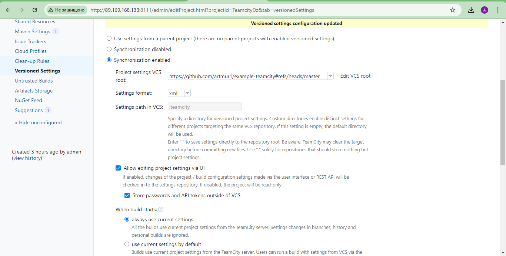

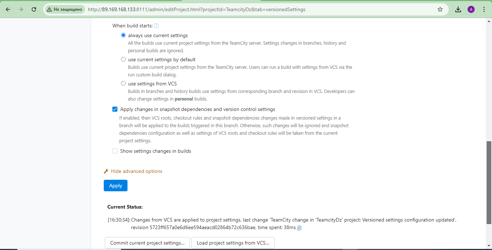

9. Создал отдельную ветку `feature/add_reply` в репозитории.
10. Написал новый метод для класса Welcomer: метод возвращает произвольную реплику, содержащую слово `hunter`:

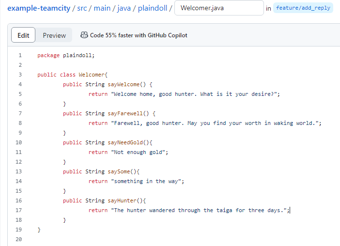

11. Дополнил тест для нового метода на поиск слова `hunter` в новой реплике:

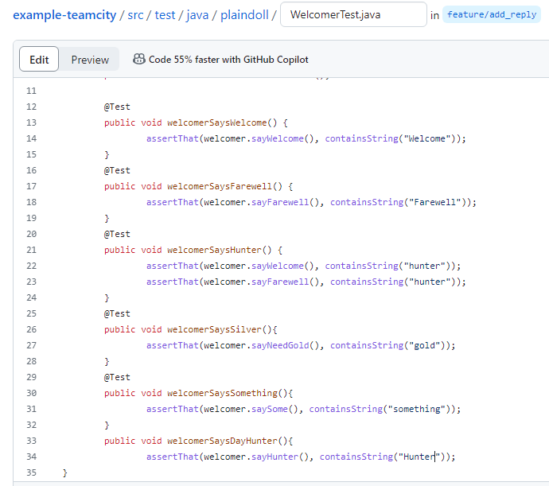

12. Сделал push всех изменений в новую ветку репозитория.
13. Убедился, что сборка самостоятельно запустилась, тесты прошли успешно:

14. Сделал `Merge` ветки `feature/add_reply` в `master`.

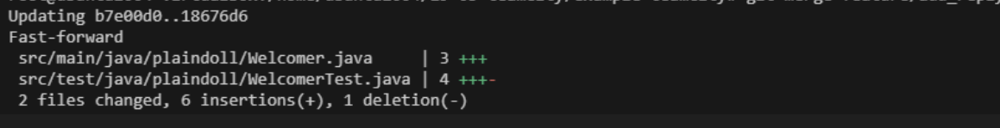

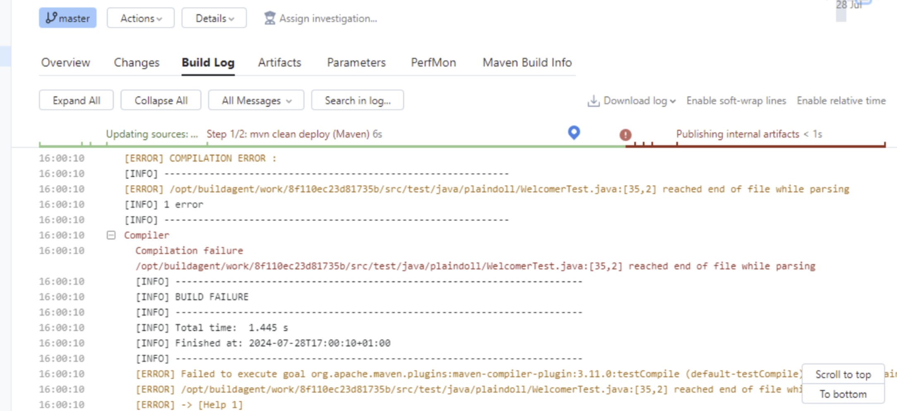

https://github.com/zhivs/example-teamcity
