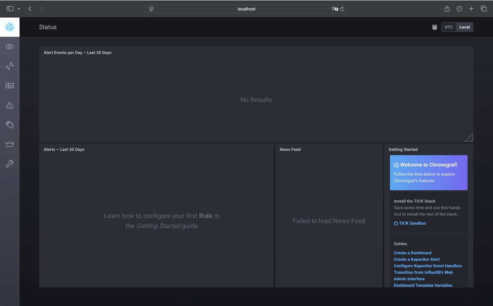
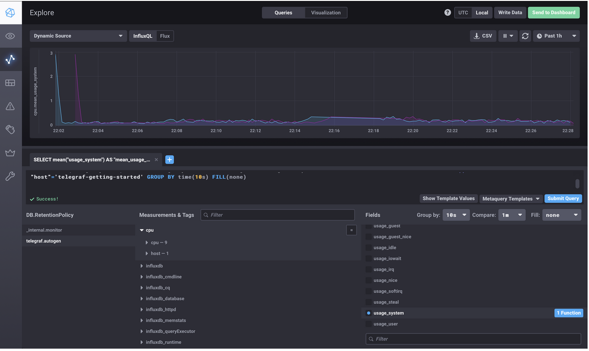
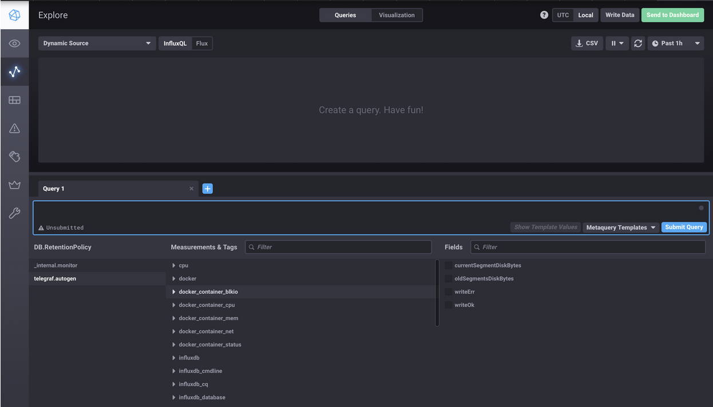

# Домашнее задание к занятию "13.Системы мониторинга"

## Обязательные задания

1. Вас пригласили настроить мониторинг на проект. На онбординге вам рассказали, что проект представляет из себя 
платформу для вычислений с выдачей текстовых отчетов, которые сохраняются на диск. Взаимодействие с платформой 
осуществляется по протоколу http. Также вам отметили, что вычисления загружают ЦПУ. Какой минимальный набор метрик вы
выведите в мониторинг и почему?

Для настройки мониторинга платформы, описанной в запросе, минимальный набор метрик должен покрывать ключевые аспекты работы системы: производительность HTTP-сервиса, нагрузку на ЦПУ, состояние хранения отчетов и healthcheck приложения.

Набор метрик и обоснование их выбора:

  - HTTP-запросы (Request Rate, Error Rate, Latency)
        Request Rate (RPS): Количество запросов в секунду. Позволяет оценить нагрузку на платформу и выявить пики активности.
        Error Rate (4xx/5xx): Доля ошибочных ответов (например, 500 для серверных ошибок, 429 для превышения лимитов). Необходима для отслеживания проблем с доступностью или логикой приложения.
        Latency (p50/p95/p99): Время ответа на запросы (среднее, 95-й и 99-й перцентили). Важно для оценки пользовательского опыта и выявления узких мест в обработке запросов.
        Почему: Поскольку взаимодействие с платформой идет по HTTP, эти метрики дают представление о доступности, производительности и стабильности сервиса.
  - Нагрузка на ЦПУ (CPU Usage, Load Average)
        CPU Usage: Процент использования ЦПУ на серверах.
        Load Average: Средняя нагрузка на систему (например, за 1, 5, 15 минут).
        Почему: Вычисления загружают ЦПУ, поэтому мониторинг его использования критичен для выявления перегрузок, планирования масштабирования и предотвращения деградации производительности.
  - Дисковые метрики (Disk Usage, I/O)
        Disk Usage: Объем занятого дискового пространства.
        Disk I/O (Read/Write Operations, Latency): Скорость и задержки операций чтения/записи.
        Почему: Отчеты сохраняются на диск, поэтому важно отслеживать, не заканчивается ли место, и нет ли проблем с производительностью записи/чтения, которые могут замедлить работу платформы.
  - Успешность вычислений (Task Success Rate, Task Duration)
        Task Success Rate: Доля успешно завершенных вычислений.
        Task Duration: Время выполнения вычислений (среднее, перцентили).
        Почему: Вычисления — ядро платформы. Мониторинг успешности и длительности задач позволяет выявить проблемы в логике вычислений или их перегрузке.
  - Состояние приложения (Uptime, Health Checks)
        Uptime: Доступность сервиса.
        Health Checks: Результаты проверок работоспособности (например, через эндпоинт /health).
        Почему: Обеспечивает базовую информацию о том, работает ли платформа в принципе, и позволяет быстро реагировать на сбои.

#
2. Менеджер продукта посмотрев на ваши метрики сказал, что ему непонятно что такое RAM/inodes/CPUla. Также он сказал, 
что хочет понимать, насколько мы выполняем свои обязанности перед клиентами и какое качество обслуживания. Что вы 
можете ему предложить?

Предлагаемые метрики

  - Процент успешных запросов
        Описание: Доля HTTP-запросов, завершившихся успешно (коды 2xx) по сравнению с общим числом запросов.
        Почему важно: Показывает, насколько часто клиенты получают ожидаемый результат (например, отчеты) без ошибок (4xx/5xx). Это напрямую отражает надежность сервиса.
        Пример: 98% запросов завершаются успешно — клиенты почти всегда получают свои отчеты.
  - Время ответа сервиса (Response Time)
        Описание: Среднее время (или 95-й перцентиль) от получения запроса до выдачи ответа клиенту.
        Почему важно: Быстрота ответа влияет на пользовательский опыт. Если время ответа растет, клиенты могут быть недовольны задержками.
        Пример: Среднее время ответа — 2 секунды, 95% запросов обрабатываются быстрее 5 секунд.
  - Время выполнения вычислений (Computation Time)
        Описание: Среднее время, необходимое для выполнения вычислений и генерации отчета.
        Почему важно: Длительные вычисления могут указывать на перегрузку или неэффективность, что влияет на клиентский опыт.
        Пример: Среднее время вычисления — 10 секунд.
  - Доступность сервиса (Uptime)
        Описание: Процент времени, когда платформа доступна для клиентов (например, отвечает на запросы).
        Почему важно: Если сервис недоступен, клиенты не могут использовать платформу, что нарушает обязательства.
        Пример: Доступность 99.9% (менее 9 минут простоя в месяц).
#
3. Вашей DevOps команде в этом году не выделили финансирование на построение системы сбора логов. Разработчики в свою 
очередь хотят видеть все ошибки, которые выдают их приложения. Какое решение вы можете предпринять в этой ситуации, 
чтобы разработчики получали ошибки приложения?

Настроить Кибану и прометеус (и т.д.) как бесплатное и минимально затратное решение, основанное на существующих ресурсах или недорогих инструментах с существующими настроенными дашбордами

#
4. Вы, как опытный SRE, сделали мониторинг, куда вывели отображения выполнения SLA=99% по http кодам ответов. 
Вычисляете этот параметр по следующей формуле: summ_2xx_requests/summ_all_requests. Данный параметр не поднимается выше 
70%, но при этом в вашей системе нет кодов ответа 5xx и 4xx. Где у вас ошибка?

Коректные ответы http сервера может быть не только 200-ые, но и 300-ые и 100-ые.

3. Время выполнения запросов

⦁ Долгие запросы: Если есть долгие запросы, которые не завершаются успешно, это может повлиять на общее количество успешных ответов. Например, если запросы зависают или обрабатываются слишком долго, это может привести к тому, что они не будут считаться успешными.

#

5. Опишите основные плюсы и минусы pull и push систем мониторинга.

Плюсы push-модели:
упрощение репликации данных в разные системы мониторинга или их резервные копии
более гибкая настройка отправки пакетов данных с метриками
UDP — это менее затратный способ передачи данных, из-за чего может возрасти
производительность сбора метрик

Плюсы pull-модели:
легче контролировать подлинность данных
можно настроить единый proxy server до всех агентов с TLS
упрощённая отладка получения данных с агентов


#
6. Какие из ниже перечисленных систем относятся к push модели, а какие к pull? А может есть гибридные?

    - Prometheus pull
    - TICK push
    - Zabbix гибридная 
    - VictoriaMetrics гибридная
    - Nagios
#
7. Склонируйте себе [репозиторий](https://github.com/influxdata/sandbox/tree/master) и запустите TICK-стэк, 
используя технологии docker и docker-compose.

В виде решения на это упражнение приведите скриншот веб-интерфейса ПО chronograf (`http://localhost:8888`). 

P.S.: если при запуске некоторые контейнеры будут падать с ошибкой - проставьте им режим `Z`, например
`./data:/var/lib:Z`


#
8. Перейдите в веб-интерфейс Chronograf (http://localhost:8888) и откройте вкладку Data explorer.
        
    - Нажмите на кнопку Add a query
    - Изучите вывод интерфейса и выберите БД telegraf.autogen
    - В `measurments` выберите cpu->host->telegraf-getting-started, а в `fields` выберите usage_system. Внизу появится график утилизации cpu.
    - Вверху вы можете увидеть запрос, аналогичный SQL-синтаксису. Поэкспериментируйте с запросом, попробуйте изменить группировку и интервал наблюдений.

Для выполнения задания приведите скриншот с отображением метрик утилизации cpu из веб-интерфейса.



#
9. Изучите список [telegraf inputs](https://github.com/influxdata/telegraf/tree/master/plugins/inputs). 
Добавьте в конфигурацию telegraf следующий плагин - [docker](https://github.com/influxdata/telegraf/tree/master/plugins/inputs/docker):
```
[[inputs.docker]]
  endpoint = "unix:///var/run/docker.sock"
```

Дополнительно вам может потребоваться донастройка контейнера telegraf в `docker-compose.yml` дополнительного volume и 
режима privileged:
```
  telegraf:
    image: telegraf:1.4.0
    privileged: true
    volumes:
      - ./etc/telegraf.conf:/etc/telegraf/telegraf.conf:Z
      - /var/run/docker.sock:/var/run/docker.sock:Z
    links:
      - influxdb
    ports:
      - "8092:8092/udp"
      - "8094:8094"
      - "8125:8125/udp"
```


После настройке перезапустите telegraf, обновите веб интерфейс и приведите скриншотом список `measurments` в 
веб-интерфейсе базы telegraf.autogen . Там должны появиться метрики, связанные с docker.
