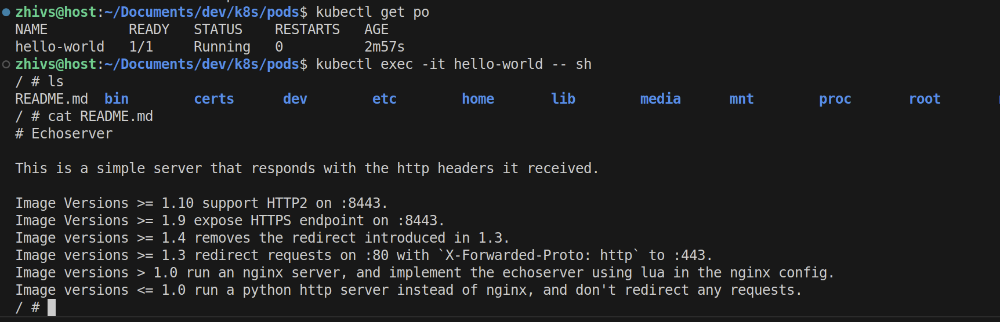
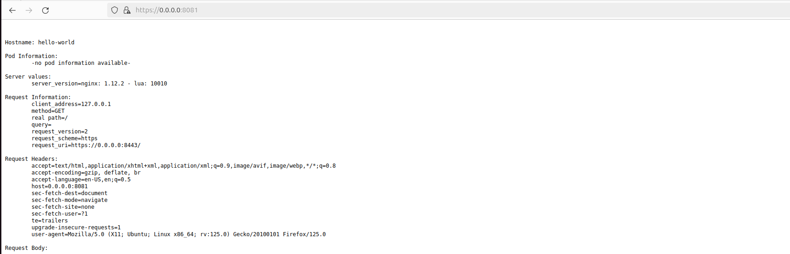
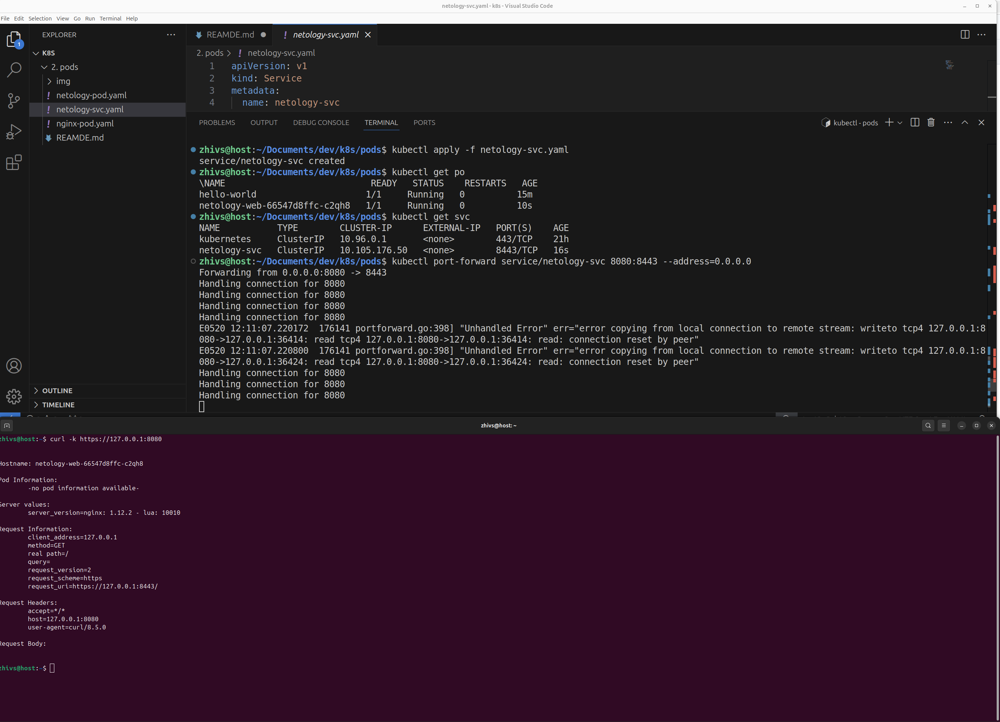

### Задание 1. Создать Pod с именем hello-world

Манифест (yaml-конфигурация) Pod.
```yaml
apiVersion: v1
kind: Pod
metadata:
  name: hello-world
spec:
  containers:
  - name: hello-world
    image: gcr.io/kubernetes-e2e-test-images/echoserver:2.2
    ports:
    - containerPort: 80
    env:
    - name: PORT
      value: "80"
```

Проверка работоспособности:



Локальное подключение к Pod с помощью `kubectl port-forward` и вывод значения

```bash
kubectl port-forward pod/hello-world 8081:8443 --address=0.0.0.0
```



------

### Задание 2. Создать Service и подключить его к Pod

Pod с именем netology-web.

```yaml
apiVersion: v1
kind: Deployment
metadata:
  name: netology-web
spec:
  selector:
    matchLabels:
      app: netology
  template:
    metadata:
      labels:
        app: netology
    spec:
      containers:
      - name: netology-web
        image: gcr.io/kubernetes-e2e-test-images/echoserver:2.2
        ports:
        - containerPort: 8443
```

Service с именем netology-svc и его подключение к netology-web.

```yaml
apiVersion: v1
kind: Service
metadata:
  name: netology-svc
spec:
  ports:
    - port: 8443
      targetPort: 8443
      protocol: TCP
  type: ClusterIP
  selector:
    app: netology
```

Проверка работоспособности:

```bash
kubectl port-forward service/netology-svc 8080:8443 --address=0.0.0.0
```

