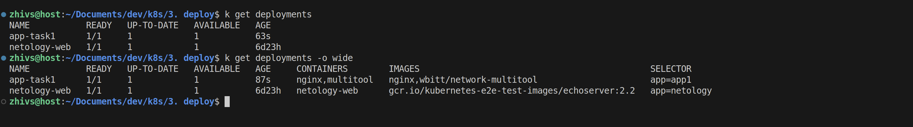
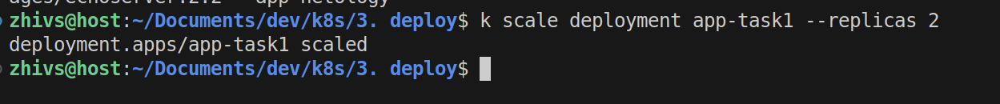
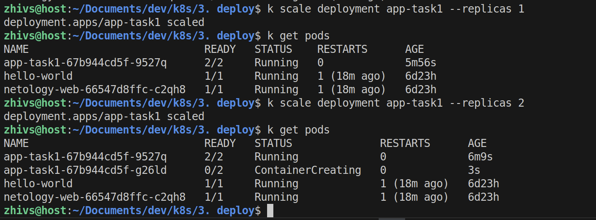
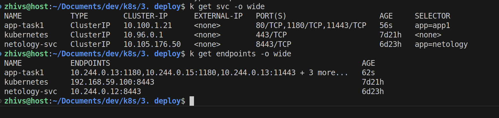
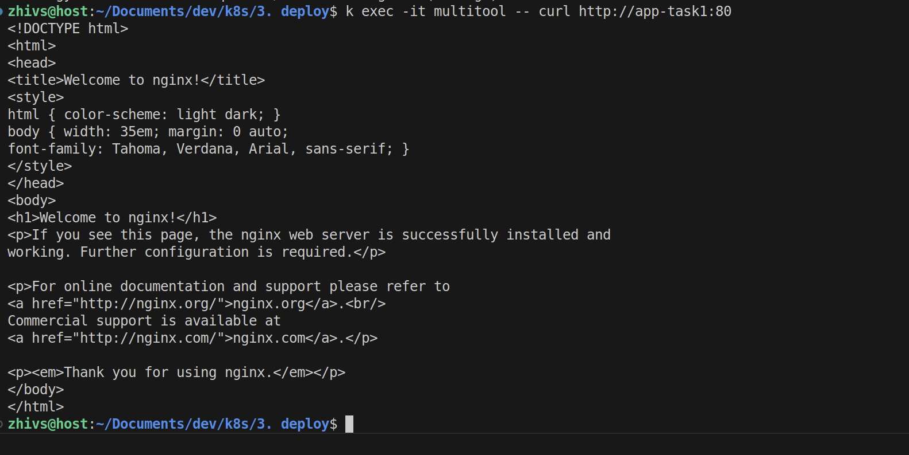
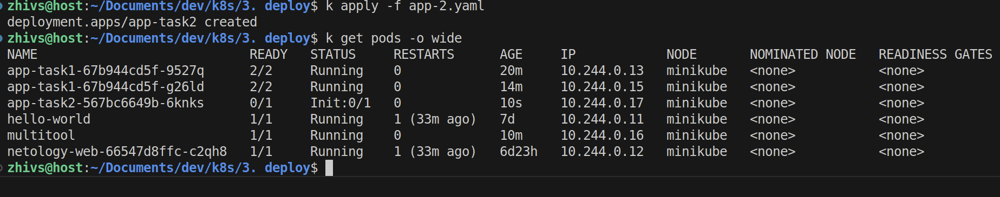
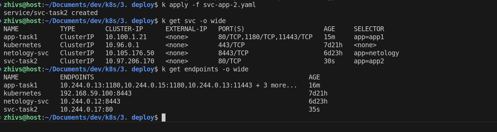
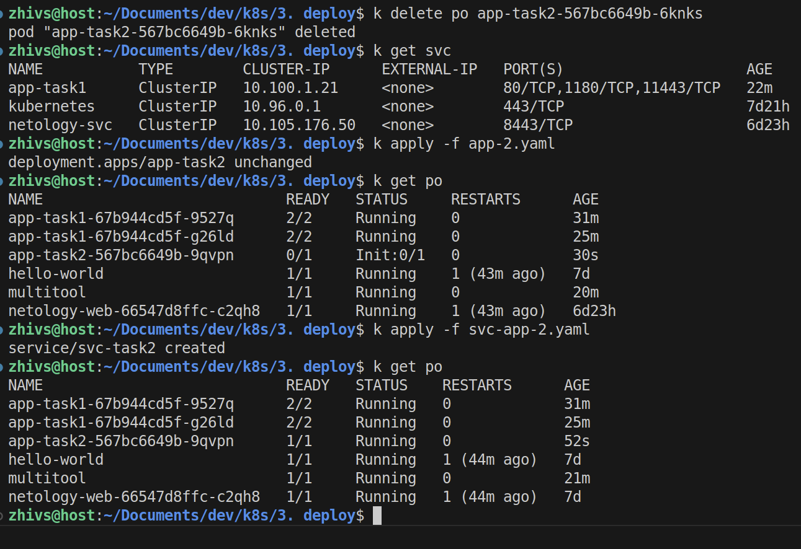

### Задание 1. Создать Deployment и обеспечить доступ к репликам приложения из другого Pod

1. Создать Deployment приложения, состоящего из двух контейнеров — nginx и multitool. Решить возникшую ошибку.

Манифест app-1.yaml:
```yaml 
---
apiVersion: apps/v1
kind: Deployment
metadata:
  name: app-task1
  labels:
    app: app1
spec:
  replicas: 1
  selector:
    matchLabels:
      app: app1
  template:
    metadata:
      labels:
        app: app1
    spec:
      containers:
      - name: nginx
        image: nginx
        ports:
        - containerPort: 80
      - name: multitool
        image: wbitt/network-multitool
        ports:
        - name: "multitool-http"
          containerPort: 1180
        - name: "multitool-https"
          containerPort: 11443
        env:
        - name: HTTP_PORT
          value: "1180"
        - name: HTTPS_PORT
          value: "11443"
...
```



2. После запуска увеличить количество реплик работающего приложения до 2.

`k scale deployment app-task1 --replicas 2`



3. Продемонстрировать количество подов до и после масштабирования.



4. Создать Service, который обеспечит доступ до реплик приложений из п.1.

Манифест Service
```yaml
---
apiVersion: v1
kind: Service
metadata:
  name: app-task1
spec:
  selector:
    app: app1
  ports:
    - name: nginx
      protocol: TCP
      port: 80
      targetPort: 80
    - name: multitool-http
      protocol: TCP
      port: 1180
      targetPort: 1180
    - name: multitool-https
      protocol: TCP
      port: 11443
      targetPort: 11443
...
```


5. Создать отдельный Pod с приложением multitool и убедиться с помощью `curl`, что из пода есть доступ до приложений из п.1.

Манифест отдельнго Pod

```yaml
---
apiVersion: v1
kind: Pod
metadata:
  labels:
    app: multitool
  name: multitool
spec:
  containers:
  - name: multitool
    image: wbitt/network-multitool
    ports:
    - name: "multitool-http"
      containerPort: 1180
    - name: "multitool-https"
      containerPort: 11443
    env:
    - name: HTTP_PORT
      value: "1180"
    - name: HTTPS_PORT
      value: "11443"
...
```


------

### Задание 2. Создать Deployment и обеспечить старт основного контейнера при выполнении условий

1. Создать Deployment приложения nginx и обеспечить старт контейнера только после того, как будет запущен сервис этого приложения.
Манифест app-2.yaml:
```yaml
---
apiVersion: apps/v1
kind: Deployment
metadata:
  name: app-task2
  labels:
    app: app2
spec:
  replicas: 1
  selector:
    matchLabels:
      app: app2
  template:
    metadata:
      labels:
        app: app2
    spec:
      containers:
      - name: nginx
        image: nginx
        ports:
        - containerPort: 80
        startupProbe:
          httpGet:
            path: /
            port: 80
          failureThreshold: 6
          periodSeconds: 10
      initContainers:
      - name: wait-svc
        image: busybox
        command: ['sh', '-c', "until nslookup svc-task2.$(cat /var/run/secrets/kubernetes.io/serviceaccount/namespace).svc.cluster.local; do echo waiting for myservice; sleep 2; done"]
...
```
2. Убедиться, что nginx не стартует. В качестве Init-контейнера взять busybox.



3. Создать и запустить Service. Убедиться, что Init запустился.



4. Продемонстрировать состояние пода до и после запуска сервиса.

