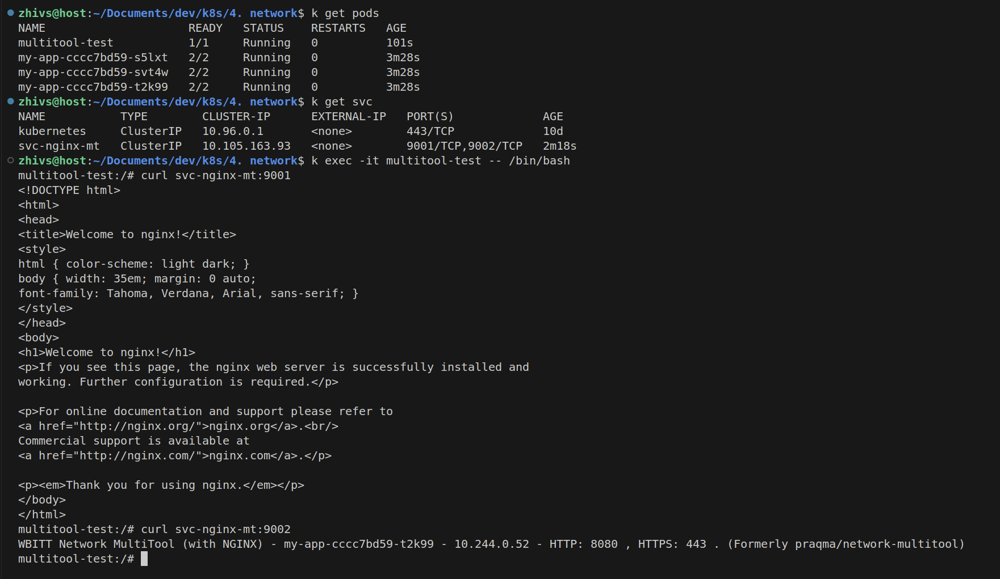
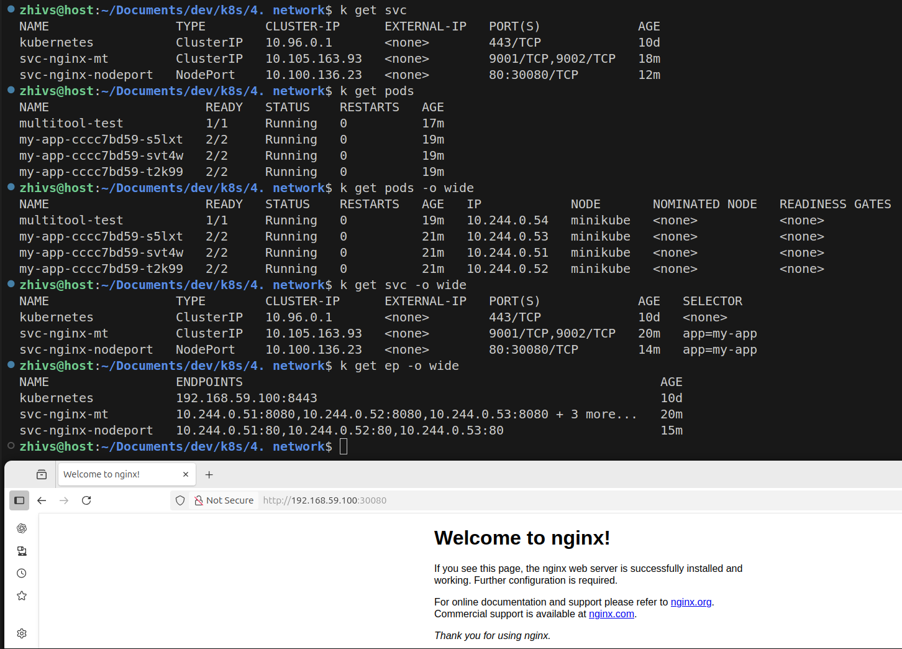

### Задание 1. Создать Deployment и обеспечить доступ к контейнерам приложения по разным портам из другого Pod внутри кластера

1. Создать Deployment приложения, состоящего из двух контейнеров (nginx и multitool), с количеством реплик 3 шт.
```yaml
apiVersion: apps/v1
kind: Deployment
metadata:
  name: my-app
spec:
  replicas: 3
  selector:
    matchLabels:
      app: my-app
  template:
    metadata:
      labels:
        app: my-app
    spec:
      containers:
      - name: nginx
        image: nginx:1.21
        ports:
        - containerPort: 80
      - name: multitool
        image: wbitt/network-multitool
        env:
          - name: HTTP_PORT
            value: "8080"
        ports:
        - containerPort: 8080
        name: http-port
```
2. Создать Service, который обеспечит доступ внутри кластера до контейнеров приложения из п.1 по порту 9001 — nginx 80, по 9002 — multitool 8080.
```yaml
apiVersion: v1
kind: Service
metadata:
  name: svc-nginx-mt
spec:
  ports:
    - name: nginx
      port: 9001
      targetPort: 80
    - name: multitool
      port: 9002
      targetPort: 8080
  selector:
    app: my-app
```
3. Создать отдельный Pod с приложением multitool и убедиться с помощью `curl`, что из пода есть доступ до приложения из п.1 по разным портам в разные контейнеры.
```yaml
apiVersion: v1
kind: Pod
metadata:
  name: multitool-test
spec:
  containers:
  - name: multitool
    image: wbitt/network-multitool
    command: ["sleep", "3600"]
```

4. Продемонстрировать доступ с помощью `curl` по доменному имени сервиса.



------

### Задание 2. Создать Service и обеспечить доступ к приложениям снаружи кластера

1. Создать отдельный Service приложения из Задания 1 с возможностью доступа снаружи кластера к nginx, используя тип NodePort.

```yaml
apiVersion: v1
kind: Service
metadata:
  name: svc-nginx-nodeport
spec:
  type: NodePort
  selector:
    app: my-app
  ports:
    - name: nginx
      protocol: TCP
      port: 80
      targetPort: 80
      nodePort: 30080
```

2. Продемонстрировать доступ с помощью браузера или `curl` с локального компьютера.


