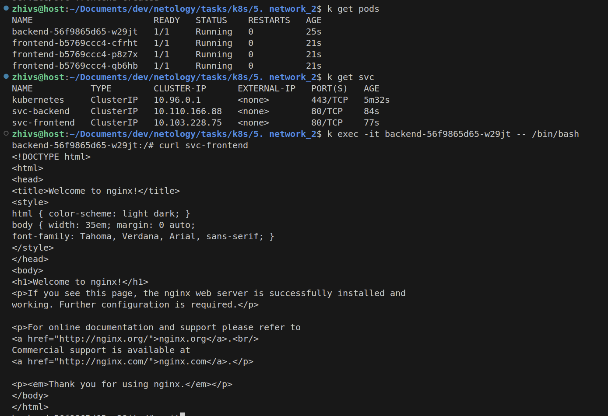
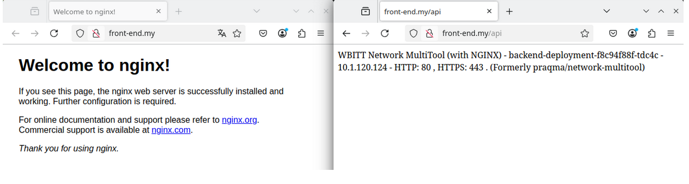

### Задание 1. Создать Deployment приложений backend и frontend

1. Создать Deployment приложения _frontend_ из образа nginx с количеством реплик 3 шт.

```yaml
apiVersion: apps/v1
kind: Deployment
metadata:
  name: frontend
spec:
  replicas: 3
  selector:
    matchLabels:
      app: frontend
  template:
    metadata:
      labels:
        app: frontend
    spec:
      containers:
      - name: nginx
        image: nginx:1.21
        ports:
        - containerPort: 80
```

2. Создать Deployment приложения _backend_ из образа multitool. 

```yaml
apiVersion: apps/v1
kind: Deployment
metadata:
  name: backend
spec:
  replicas: 1
  selector:
    matchLabels:
      app: backend
  template:
    metadata:
      labels:
        app: backend
    spec:
      containers:
      - name: multitool
        image: wbitt/network-multitool
        env:
          - name: HTTP_PORT
            value: "8080"
        ports:
        - containerPort: 8080
        name: http-port
```

3. Добавить Service, которые обеспечат доступ к обоим приложениям внутри кластера.

service-nginx:
```yaml
apiVersion: v1
kind: Service
metadata:
  name: svc-frontend
spec:
  selector:
    app: frontend
  ports:
  - protocol: TCP
    port: 80
    targetPort: 80
``` 

service-mt:
```
apiVersion: v1
kind: Service
metadata:
  name: svc-backend
spec:
  selector:
    app: backend
  ports:
  - protocol: TCP
    port: 80
    targetPort: 8080
```

4. Продемонстрировать, что приложения видят друг друга с помощью Service.


------

### Задание 2. Создать Ingress и обеспечить доступ к приложениям снаружи кластера

1. Включить Ingress-controller в MicroK8S.
```bash
sudo microk8s enable ingress
```

2. Создать Ingress, обеспечивающий доступ снаружи по IP-адресу кластера MicroK8S так, чтобы при запросе только по адресу открывался _frontend_ а при добавлении /api - _backend_.
```yaml
apiVersion: networking.k8s.io/v1 
kind: Ingress
metadata:
  name: ingress
  annotations:
    nginx.ingress.kubernetes.io/rewrite-target: / 
spec:
  ingressClassName: "nginx"
  rules:
  - host: front-end.my
    http: 
      paths:
      - path: /
        pathType: Prefix
        backend:
          service:
            name: frontend-service
            port: 
              number: 80
      - path: /api
        pathType: Exact
        backend:
          service:
            name: backend-service 
            port: 
              number: 80
```

3. Продемонстрировать доступ с помощью браузера или `curl` с локального компьютера.

