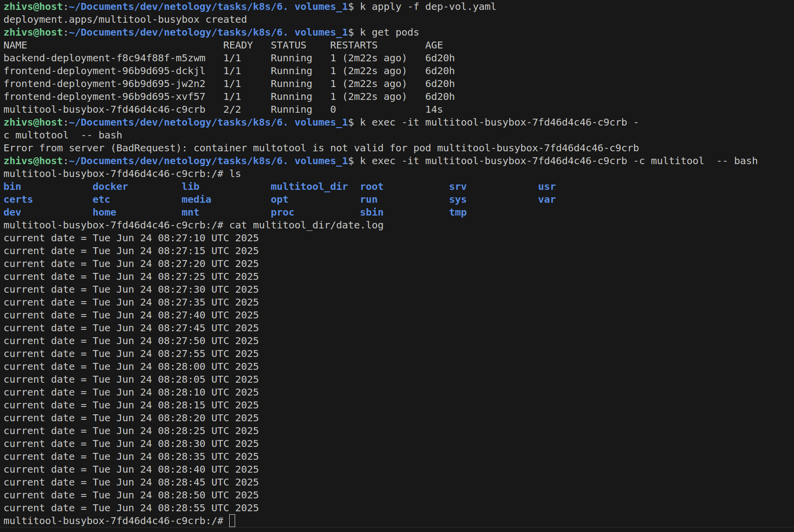
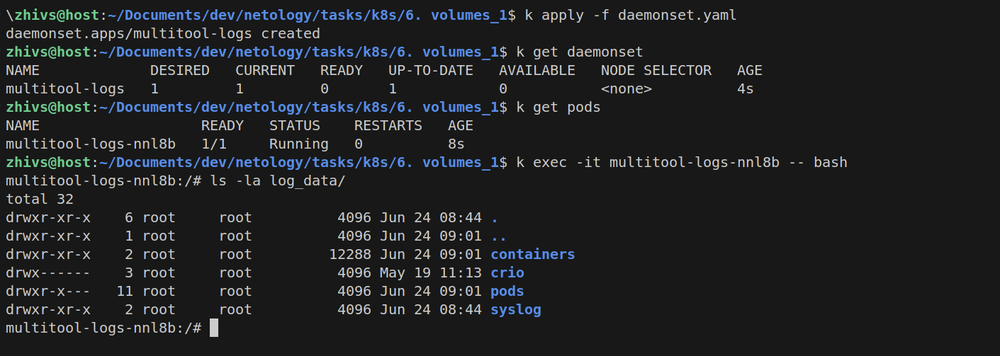

### Задание 1 

**Что нужно сделать**

Создать Deployment приложения, состоящего из двух контейнеров и обменивающихся данными.

1. Создать Deployment приложения, состоящего из контейнеров busybox и multitool. Сделать так, чтобы busybox писал каждые пять секунд в некий файл в общей директории.  Обеспечить возможность чтения файла контейнером multitool.
```yaml
apiVersion: apps/v1
kind: Deployment
metadata:
  name: multitool-busybox
spec:
  replicas: 1
  selector:
    matchLabels:
      app: main
  template:
    metadata:
      labels:
        app: main
    spec:
      containers:
      - name: busybox
        image: busybox
        command: ['sh', '-c', 'while true; do echo "current date = $(date)" >> /busybox_dir/date.log; sleep 5; done']
        volumeMounts:
          - mountPath: "/busybox_dir"
            name: deployment-volume
      - name: multitool
        image: wbitt/network-multitool
        volumeMounts:
          - name: deployment-volume
            mountPath: "/multitool_dir"
      volumes:
        - name: deployment-volume
          emptyDir: {}
```

2. Продемонстрировать, что multitool может читать файл, который периодоически обновляется.



------

### Задание 2

**Что нужно сделать**

Создать DaemonSet приложения, которое может прочитать логи ноды.

1. Создать DaemonSet приложения, состоящего из multitool. Обеспечить возможность чтения файла `/var/log/syslog` кластера MicroK8S. 
```yaml
apiVersion: apps/v1
kind: DaemonSet
metadata:
  name: multitool-logs
spec:
  selector:
    matchLabels:
      app: mt-logs
  template:
    metadata:
      labels:
        app: mt-logs
    spec:
      containers:
        - name: multitool
          image: wbitt/network-multitool
          volumeMounts:
            - name: log-volume
              mountPath: /log_data
      volumes:
        - name: log-volume
          hostPath:
            path: /var/log
```


2. Продемонстрировать возможность чтения файла изнутри пода.

На основной машине у меня minikube, а внутри этого окружения логи записываются чуть иначе.


