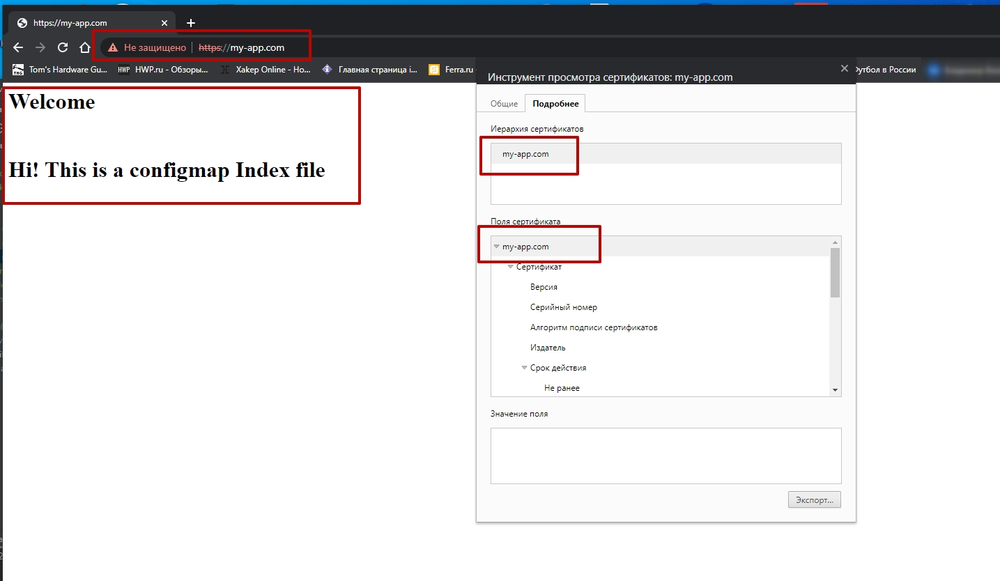
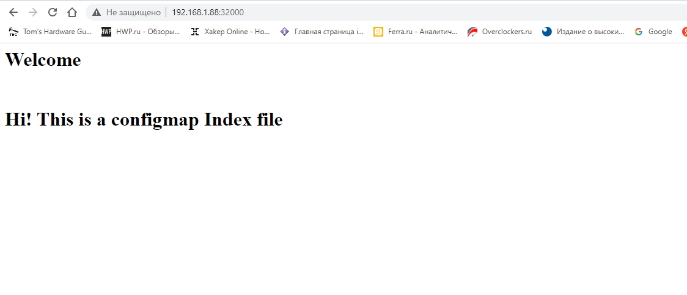

### Задание 1. Создать Deployment приложения и решить возникшую проблему с помощью ConfigMap. Добавить web-страницу

Манифесты:

- [Deployment](file/ConfigMapDep.yaml)
- [Service](file/myservice.yaml)
- [ConfigMap](file/index-html-configmap.yaml)

```bash
$ kubectl apply -f file/myservice.yaml 
service/myservice created

$ kubectl get service
NAME         TYPE        CLUSTER-IP       EXTERNAL-IP   PORT(S)                         AGE
kubernetes   ClusterIP   10.152.183.1     <none>        443/TCP                         38d
myservice    NodePort    10.152.183.153   <none>        80:32000/TCP                    10s

$ kubectl apply -f file/index-html-configmap.yaml 
configmap/index-html-configmap created

$ kubectl get cm
NAME                   DATA   AGE
kube-root-ca.crt       1      38d
index-html-configmap   1      13s

$ kubectl apply -f file/ConfigMapDep.yaml 
deployment.apps/myapp-pod created

$ kubectl get pod
NAME                         READY   STATUS    RESTARTS   AGE
myapp-pod-5bb5fbc745-tn2nx   1/1     Running   0          20s
```

```bash
$ kubectl describe pod myapp-pod-5bb5fbc745-tn2nx
Name:         myapp-pod-5bb5fbc745-tn2nx
Namespace:    default
Priority:     0
Node:         microk8s/192.168.1.88
Start Time:   Tue, 21 Mar 2023 23:46:53 +0300
Labels:       app=myapp
              pod-template-hash=5bb5fbc745
Annotations:  cni.projectcalico.org/containerID: 6803c4d2220a4f790c43726c26e6d887560768e0ac16eac9e691e7b10ca9b4db
              cni.projectcalico.org/podIP: 10.1.128.221/32
              cni.projectcalico.org/podIPs: 10.1.128.221/32
Status:       Running
IP:           10.1.128.221
IPs:
  IP:           10.1.128.221
Controlled By:  ReplicaSet/myapp-pod-5bb5fbc745
Init Containers:
  init-myservice:
    Container ID:  containerd://deef8650813540c4b342bc27a2b5795d1a09c16e378adeb6249e6ff762a9a31a
    Image:         busybox:1.28
    Image ID:      docker.io/library/busybox@sha256:141c253bc4c3fd0a201d32dc1f493bcf3fff003b6df416dea4f41046e0f37d47
    Port:          <none>
    Host Port:     <none>
    Command:
      sh
      -c
      until nslookup myservice.$(cat /var/run/secrets/kubernetes.io/serviceaccount/namespace).svc.cluster.local; do echo waiting for myservice; sleep 2; done
    State:          Terminated
      Reason:       Completed
      Exit Code:    0
      Started:      Tue, 21 Mar 2023 23:46:57 +0300
      Finished:     Tue, 21 Mar 2023 23:46:57 +0300
    Ready:          True
    Restart Count:  0
    Environment:    <none>
    Mounts:
      /var/run/secrets/kubernetes.io/serviceaccount from kube-api-access-7r5c6 (ro)
Containers:
  network-multitool:
    Container ID:   containerd://be469c26ac4d72641408d4bb37dda0fd3cc4fa9a2bf5816f21072d1436bc640a
    Image:          wbitt/network-multitool
    Image ID:       docker.io/wbitt/network-multitool@sha256:82a5ea955024390d6b438ce22ccc75c98b481bf00e57c13e9a9cc1458eb92652
    Port:           <none>
    Host Port:      <none>
    State:          Running
      Started:      Tue, 21 Mar 2023 23:46:58 +0300
    Ready:          True
    Restart Count:  0
    Limits:
      cpu:     200m
      memory:  512Mi
    Requests:
      cpu:        100m
      memory:     256Mi
    Environment:  <none>
    Mounts:
      /usr/share/nginx/html/ from nginx-index-file (rw)
      /var/run/secrets/kubernetes.io/serviceaccount from kube-api-access-7r5c6 (ro)
Conditions:
  Type              Status
  Initialized       True
  Ready             True
  ContainersReady   True
  PodScheduled      True
Volumes:
  nginx-index-file:
    Type:      ConfigMap (a volume populated by a ConfigMap)
    Name:      index-html-configmap
    Optional:  false
  kube-api-access-7r5c6:
    Type:                    Projected (a volume that contains injected data from multiple sources)
    TokenExpirationSeconds:  3607
    ConfigMapName:           kube-root-ca.crt
    ConfigMapOptional:       <nil>
    DownwardAPI:             true
QoS Class:                   Burstable
Node-Selectors:              <none>
Tolerations:                 node.kubernetes.io/not-ready:NoExecute op=Exists for 300s
                             node.kubernetes.io/unreachable:NoExecute op=Exists for 300s
Events:                      <none>
```

Проверяем curl

```bash
$ curl 192.168.1.88:32000
<html>
<h1>Welcome</h1>
</br>
<h1>Hi! This is a configmap Index file </h1>
</html
```

И через браузер



------

### Задание 2. Создать приложение с вашей web-страницей, доступной по HTTPS 

#### Решение

1. Создать Deployment приложения состоящего из nginx.

   - [Deployment2](file/2/ConfigMapDep2.yaml)

   Тот же образ, что и в первом задании. Есть веб-сервер и есть созданная страница с помощью ConfigMap 
2. Создать собственную web-страницу и подключить ее как ConfigMap к приложению.

   - [ConfigMap](file/index-html-configmap.yaml)

3. Выпустить самоподписной сертификат SSL. Создать Secret для использования данного сертификата.

```bash
root@microk8s:~# openssl req -x509 -newkey rsa:4096 -sha256 -nodes -keyout tls.key -out tls.crt -subj "/CN=my-app.com" -days 365
-----
```

   - [tls.crt](cert/tls.crt)
   - [tls.key](cert/tls.key)

4. Создать Ingress и необходимый Service, подключить к нему SSL в вид. Продемонстировать доступ к приложению по HTTPS. 

Создаем `secret`
```bash
$ kubectl create secret tls my-app-secret-tls --cert=cert/tls.crt --key=cert/tls.key 
secret/my-app-secret-tls created
```

```bash
$ kubectl get secret -o yaml
apiVersion: v1
items:
- apiVersion: v1
  data:
    tls.crt: 
  kind: Secret
  metadata:
    creationTimestamp: "2023-03-29T11:41:58Z"
    name: my-app-secret-tls
    namespace: default
    resourceVersion: "235054"
    uid: fc415050-a222-4813-a5b1-90736153dcda
  type: kubernetes.io/tls
kind: List
metadata:
  resourceVersion: ""
  selfLink: ""
```

Создаем ингресс и сервис
   - [ingress](file/2/ingress.yaml)
   - [myservice2](file/2/myservice2.yaml)

5. Предоставить манифесты, а также скриншоты и/или вывод необходимых команд.

Днс my-app.com в файл `hosts` и проверяем доступность измененной страницы.
```yaml
$ curl -k https://my-app.com
<html>
<h1>Welcome</h1>
</br>
<h1>Hi! This is a configmap Index file </h1>
</html
```

Наличие сертификата через браузер.



